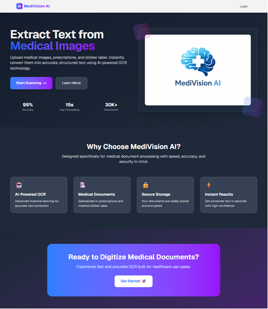
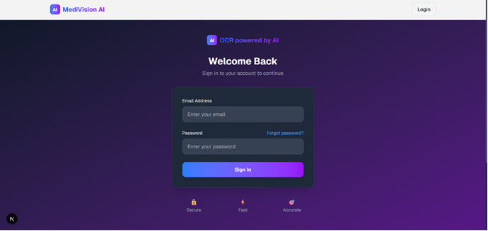
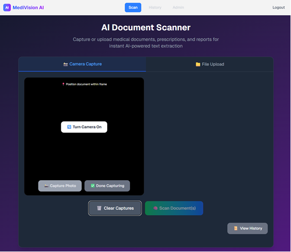
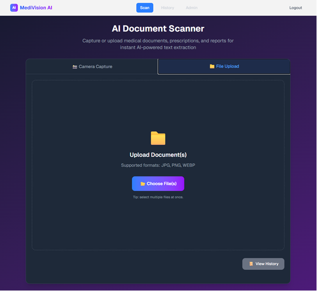
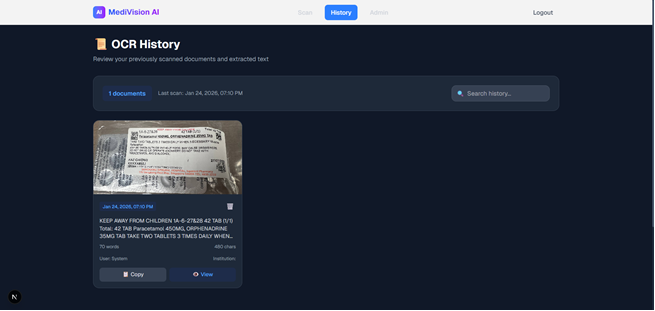
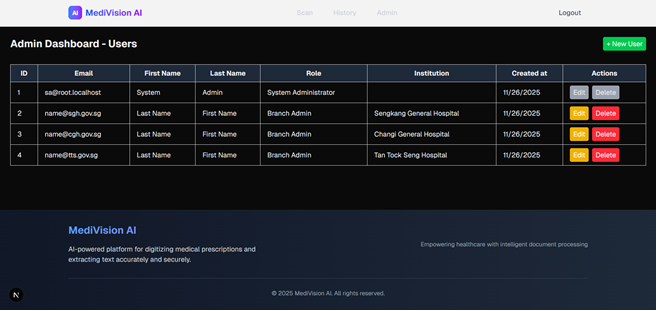

# AI OCR Web Portal

A full-stack web application that uses OCR and OpenAI to extract and structure information from medication labels.

Developed as a Major Project as part of the Diploma in Computer Engineering at Temasek Polytechnic by a team of three students.

## Project Overview

Medication labels often contain important information in an unstructured format. This project allows users to capture or upload images of medication labels, extract text using OCR, and use AI to organise the extracted information into a structured and readable format.

The system also includes user authentication, scan history management, and administrative features for managing users and institutions.

## Key Features

* User registration and login
* Password reset via email
* Image upload and camera capture
* OCR text extraction
* OpenAI-powered text structuring
* Scan history tracking
* Search and filtering of previous scans
* Admin dashboard for user and institution management

## Technologies Used

### Frontend

* Next.js
* React
* TypeScript
* Tailwind CSS

### Backend

* Node.js
* REST APIs
* JWT Authentication

### Database

* MySQL

### AI & OCR

* OpenAI API
* OCR processing library

## My Contributions

As part of a three-member team project, my responsibilities included:

* Developing frontend user interfaces
* Implementing image upload and scanning workflows
* Integrating OpenAI API functionality
* Connecting frontend and backend services through REST APIs
* Testing and debugging application features

## Screenshots

Screenshots can be found in the `/screenshots` directory.

* Landing Page

* Login Page

* Scan Page

* Scan History Page

* Admin Dashboard

## Running the Project

### Prerequisites

* Node.js
* MySQL
* OpenAI API Key

### Installation

#### 1. Install Dependencies

Run:

`npm install`

#### 2. Configure Environment Variables

Create a `.env` file using the provided `.env.example` template.

Provide values for:

* Database credentials
* Email credentials
* JWT secret
* OpenAI API key

#### 3. Start the Application

Run:

`npm run dev`

The application will be available at:

`http://localhost:3000`

## Environment Variables

The repository does not include secrets, passwords, or API keys.

Create a `.env` file and provide your own values for:

DB_HOST

DB_USER

DB_PASSWORD

DB_NAME

EMAIL_USER

EMAIL_PASS

JWT_SECRET

OPENAI_API_KEY

## Notes

* This repository is intended for portfolio and educational purposes.
* API keys, passwords, and other sensitive credentials have been removed.
* Some services require external accounts and configuration before the application can run successfully.
* OpenAI usage requires a valid API key and available credits.

## Project Status

Completed (Major Project – Team of Three)
